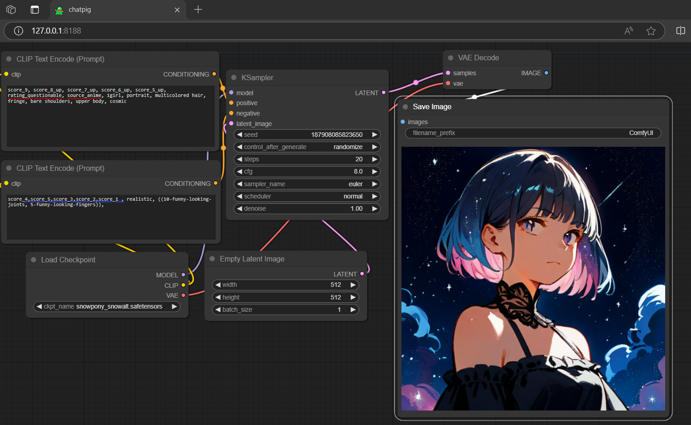
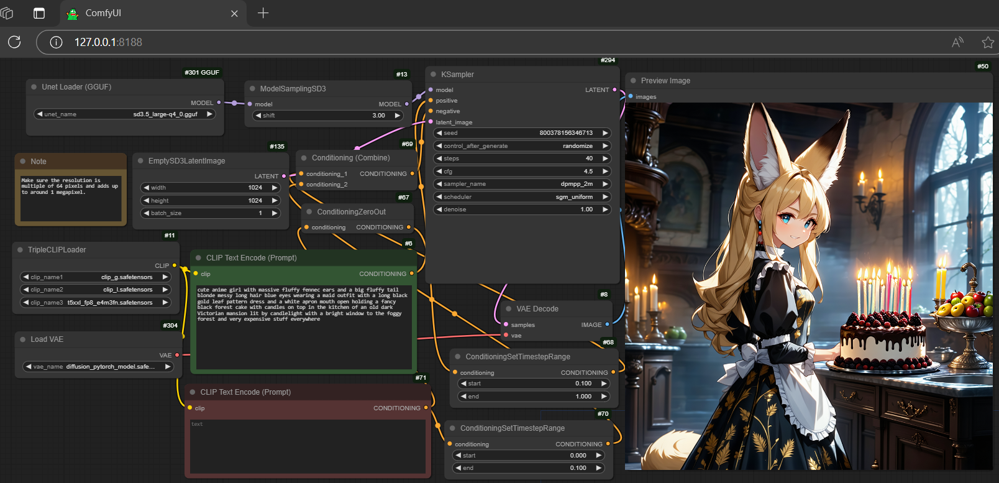

## comfy
Get the ComfyUI windows portable 7z:
### [Download Portal](https://github.com/calcuis/comfy/releases/download/0.0.3/ComfyUI_GGUF_windows_portable.7z)
- decompress the 7z bundle file: Extract All... (it includes everything you need)
- setup: pull any checkpoint (i.e., stable-diffusion model) file (.ckpt/.safetensors) into the folder ./ComfyUI/models/checkpoints
- go back to the main directory; look for run_cpu or run_gpu
- run the Batch file (.bat)

#### GGUF-supported upgrade
Run gguf model (flux1 as an example below):
- you could either get the backup pack [here](https://huggingface.co/calcuis/flux1-gguf/tree/main) or pick them one-by-one from the original source below
- download [flux1-dev-Q4_0.gguf](https://huggingface.co/city96/FLUX.1-dev-gguf/blob/main/flux1-dev-Q4_0.gguf) (6.32GB); pull it to ./ComfyUI/models/unet
- download [clip_l.safetensors](https://huggingface.co/comfyanonymous/flux_text_encoders/blob/main/clip_l.safetensors) (234MB) and [t5xxl_fp8_e4m3fn.safetensors](https://huggingface.co/comfyanonymous/flux_text_encoders/blob/main/t5xxl_fp8_e4m3fn.safetensors) (4.55GB); pull them to ./ComfyUI/models/clip
- download [ae.safetensors](https://huggingface.co/black-forest-labs/FLUX.1-schnell/blob/main/ae.safetensors) (319MB); pull it to ./ComfyUI/models/vae
- run the .bat file under the main directory (it will activate the py backend as well as the js frontend)
- drag [workflow-gguf.json](https://github.com/calcuis/comfy/blob/main/workflow-gguf.json) to the activated browser

##### Reference: [gguf-comfy](https://github.com/calcuis/gguf-comfy)

#### Stable Diffusion 3.5 is now supported

Run sd3 model following the step-by-step guide below:
- you could either get the backup pack [here](https://huggingface.co/calcuis/sd3.5-large-gguf/tree/main) or pick them one-by-one from the original source below
- download [sd3.5_large-q4_0.gguf](https://huggingface.co/calcuis/sd3.5-large-gguf/blob/main/sd3.5_large-q4_0.gguf) (4.77GB); pull it to ./ComfyUI/models/unet
- download [clip_g.safetensors](https://huggingface.co/stabilityai/stable-diffusion-3.5-large/blob/main/text_encoders/clip_g.safetensors) (1.39GB),  [clip_l.safetensors](https://huggingface.co/comfyanonymous/flux_text_encoders/blob/main/clip_l.safetensors) (234MB), and [t5xxl_fp8_e4m3fn.safetensors](https://huggingface.co/comfyanonymous/flux_text_encoders/blob/main/t5xxl_fp8_e4m3fn.safetensors) (4.55GB); pull them all to ./ComfyUI/models/clip
- download [diffusion_pytorch_model.safetensors](https://huggingface.co/stabilityai/stable-diffusion-3.5-large/blob/main/vae/diffusion_pytorch_model.safetensors) (168MB); pull it to ./ComfyUI/models/vae
- run the .bat file under the main directory (it will activate the py backend as well as the js frontend)
- drag [workflow-sd3.5-gguf.json](https://github.com/calcuis/comfy/blob/main/workflow-sd3.5-gguf.json) to the activated browser

##### Reference: [stability-ai](https://github.com/Stability-AI/sd3.5)
